# Bank Marketing Machine Learning Deployment

## Project Overview

In this project, we will leverage the Bank Marketing dataset to build, deploy, and consume a cloud-based machine learning production model using Microsoft Azure. This project encompasses several key steps to create a comprehensive end-to-end machine learning solution. The primary objectives of this project include authentication setup, automated machine learning experimentation, model deployment, logging implementation, Swagger documentation, model endpoint consumption, pipeline creation and publication, and comprehensive documentation.

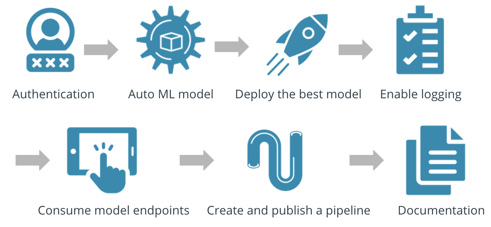

1. **Authentication:**
   - Setting up secure authentication and access controls for your Azure resources is the first crucial step. This ensures that your machine learning resources and data are protected from unauthorized access.
   
   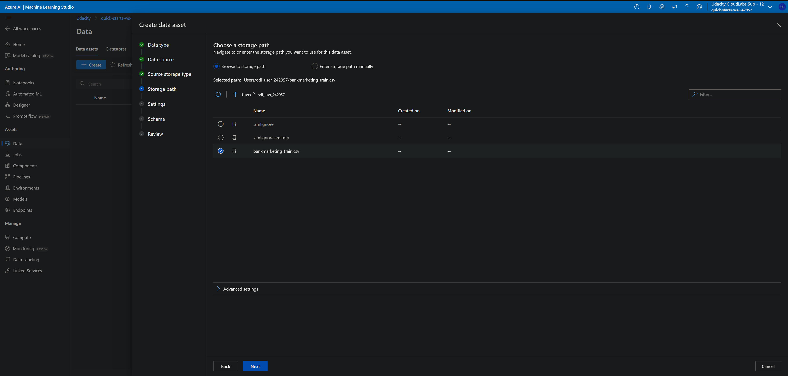
   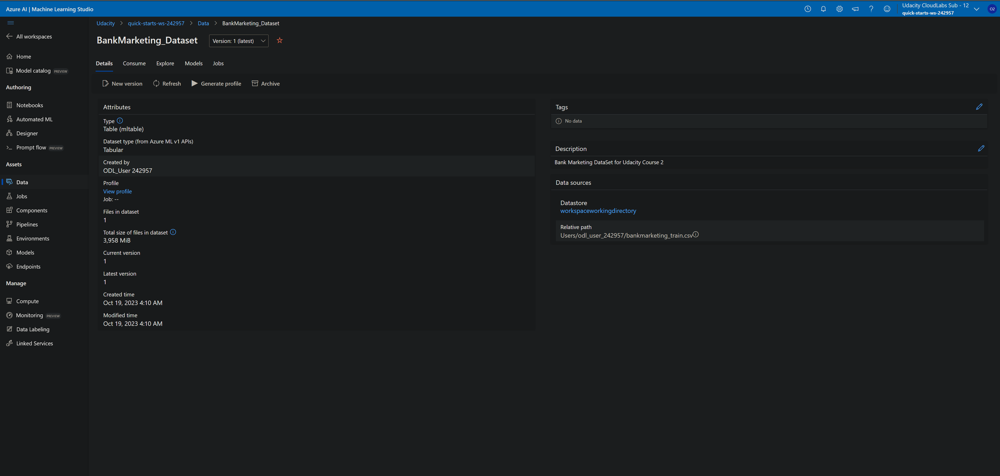
   

2. **Automated ML Experiment:**
   - Utilizing Azure's Automated Machine Learning capabilities, we will explore various machine learning models and hyperparameters. This process helps us identify the best-performing model for the given dataset.
   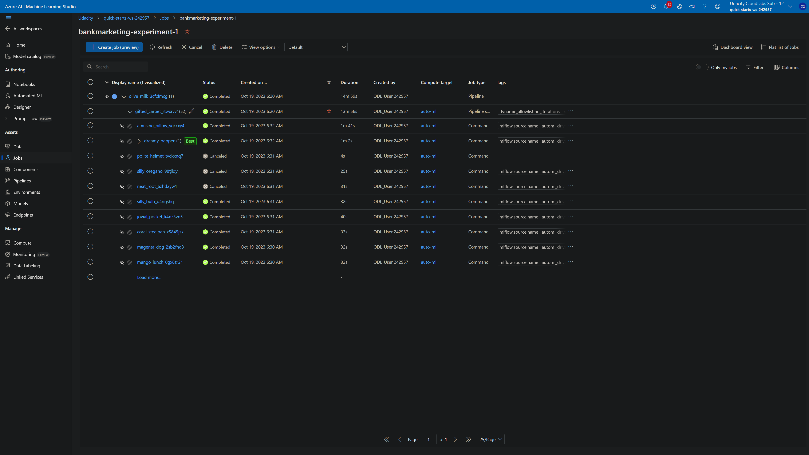
   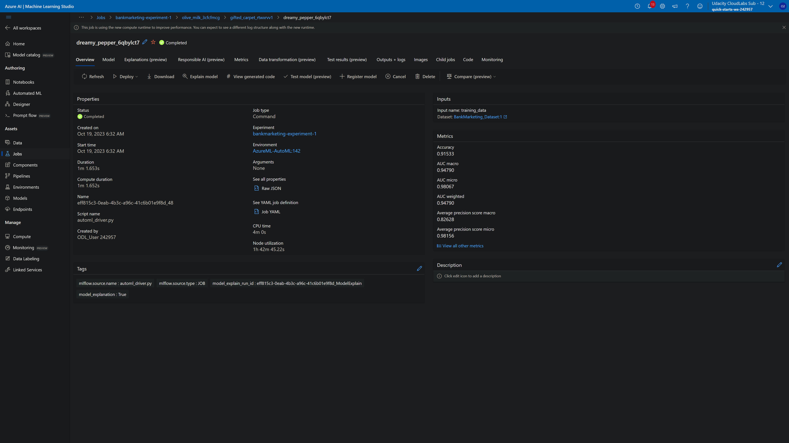
   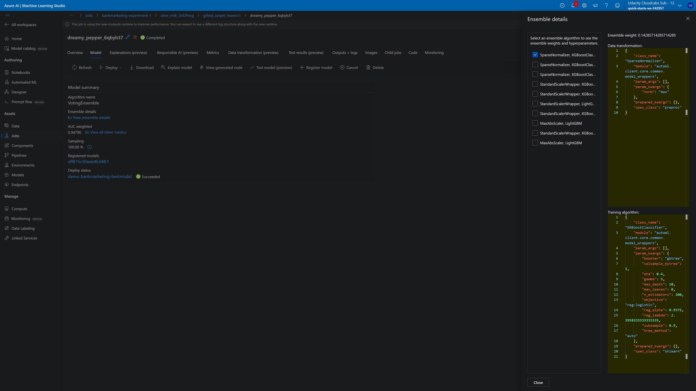

3. **Deploy the Best Model:**
   - Once the best model has been identified, we will deploy it as a production model on Azure. This deployment ensures that the model can be accessed and utilized by other services and applications.
   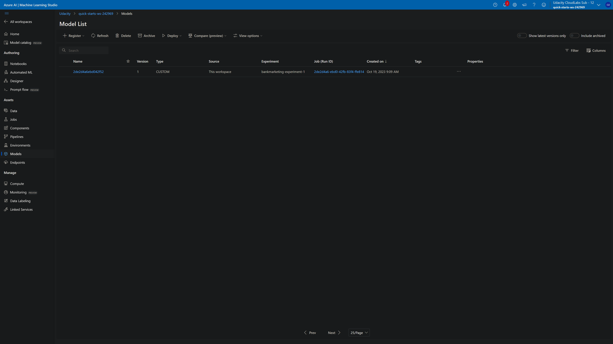

4. **Enable Logging:**
   - Implementing logging is essential for monitoring the model's performance and usage. It allows us to track how the model is performing in real-time and troubleshoot any issues that may arise.
   

5. **Swagger Documentation:**
   - Swagger documentation will be created to provide a clear and interactive interface for users to understand the model's capabilities and usage. This documentation makes it easier for developers to integrate the model into their applications.
   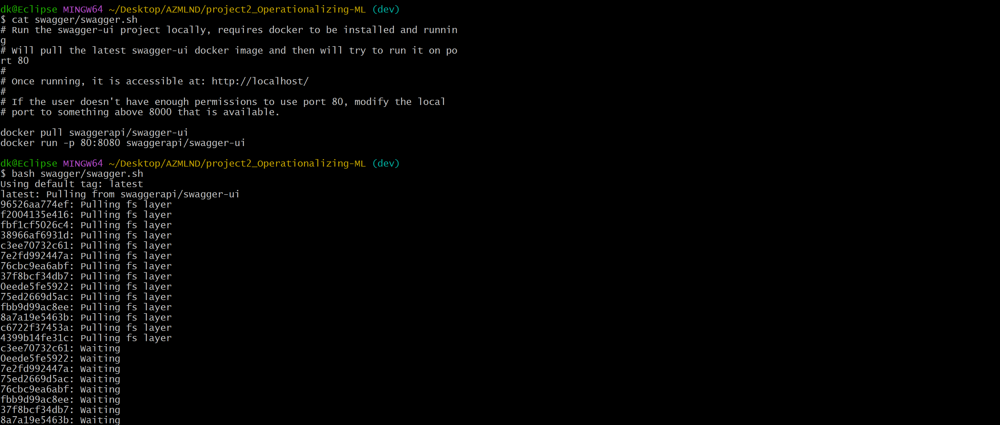
   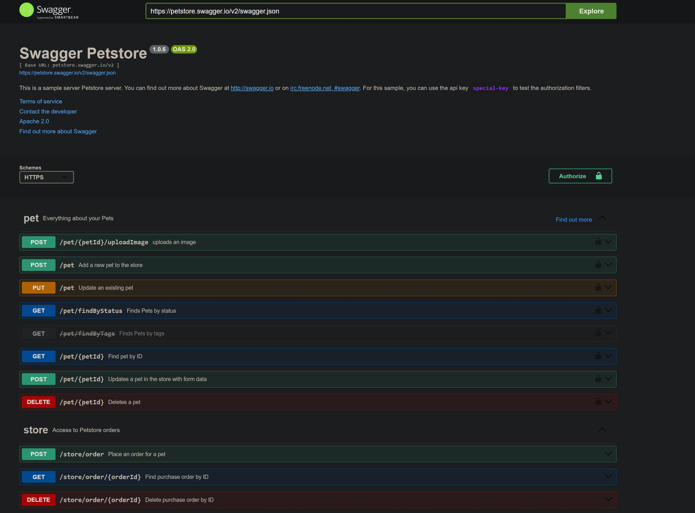
   

6. **Consume Model Endpoints:**
   - We will demonstrate how to consume the model's endpoints, showing how to send data to the deployed model and receive predictions in return. This step is crucial for integrating the model into other applications and services.
   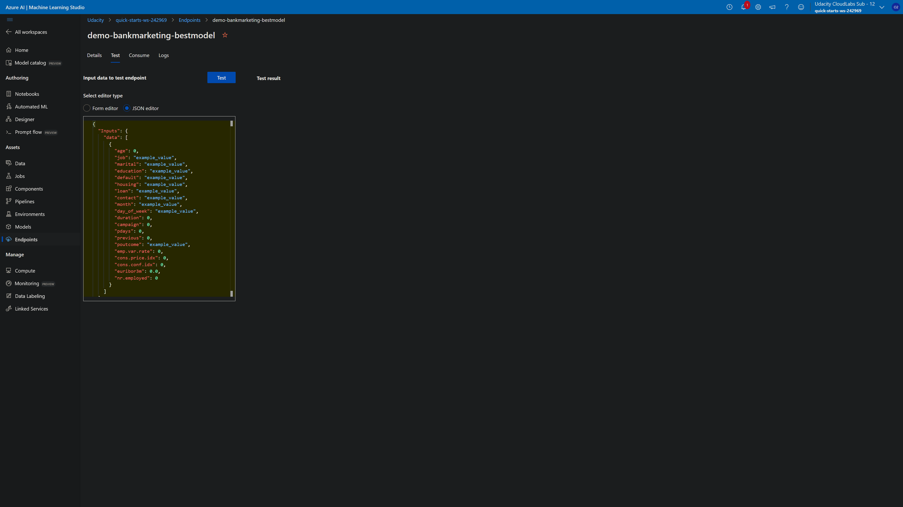
   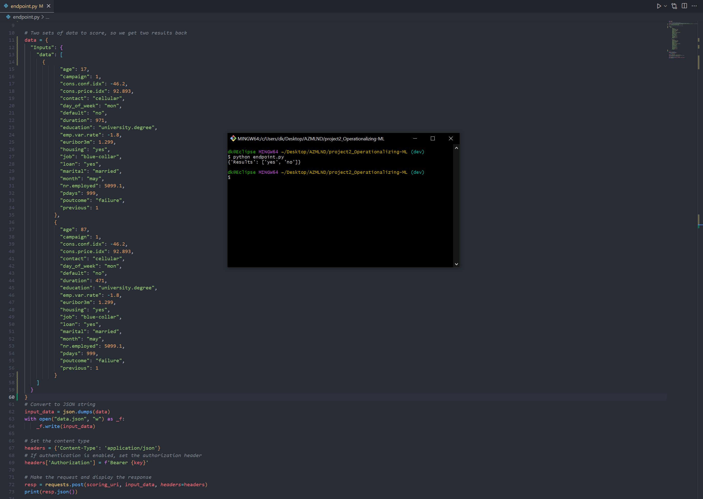

   - I also benchmarked the endpoint with Apache Bench.
   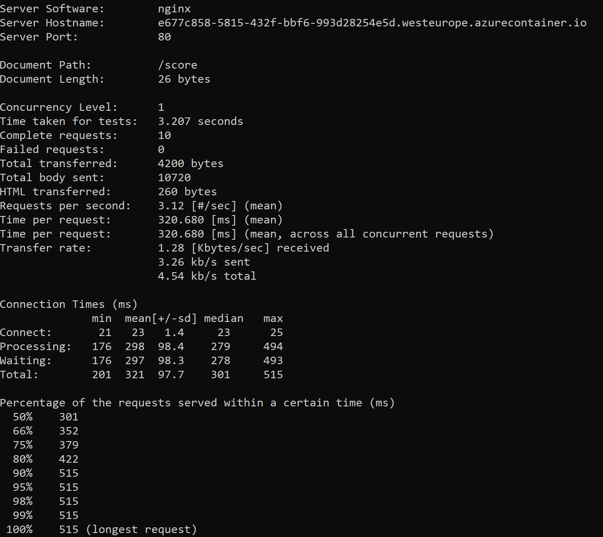

## Architectural Diagram

     +-----------------------+
     |                       |
     |  1. Upload and        |
     |     Register Bank     |
     |     Marketing Dataset |
     |                       |
     |                       |
     +----------+------------+
                |
                v

     +-----------------------+
     |                       |
     |  2. Create AutoML     |
     |     Experiment        |
     |                       |
     |                       |
     +----------+------------+
                |
                v

     +-----------------------+
     |                       |
     |  3. Best Performing   |
     |     Run               |
     |                       |
     |                       |
     +----------+------------+
                |
                v

     +-----------------------+
     |                       |
     |  4. Enable Application|
     |     Insights          |
     |                       |
     |                       |
     +----------+------------+
                |
                v

     +-----------------------+
     |                       |
     |  5. Configure Swagger  |
     |     Docs              |
     |                       |
     |                       |
     +----------+------------+
                |
                v

     +-----------------------+
     |                       |
     |  6. Consuming the      |
     |     Deployed Endpoint |
     |                       |
     |                       |
     +-----------------------+

## Key Steps

1. **Upload and Register Bank Marketing Dataset**
   - Begin by uploading the Bank Marketing dataset to Azure Workspace.

2. **Create AutoML Experiment**
   - Set up an Azure AutoML Model.
   - Configure a Compute Cluster to run various models using different algorithms within the AutoML experiment.

3. **Best Performing Run**
   - Identify the best model, which is a VotingEnsemble Model.
   - Deploy this model to make it accessible.
   - Monitor its performance in Azure ML Studio.

4. **Enable Application Insights**
   - Enable application logging by downloading the configuration file from Azure Workspace.
   - Add the configuration file to working directory.
   - Activate application insights by running the `logs.py` script in the shell.

5. **Configure Swagger Docs**
   - Adjust the port number in a provided Bash Script.
   - Access the Swagger UI on your local machine.
   - Start the server using `serve.py` to explore the model's json documentation.

6. **Consuming the Deployed Endpoint**
   - Consume the deployed model by adapting the endpoint URI and key in `endpoints.py`.
   - Run the `endpoints.py` script to make predictions using the model.
   
## Screen Recording

## Standout Suggestions
* **Parallel Run in Pipeline**: Implement a parallel run step in your pipeline to accelerate the training process. Parallel processing can significantly reduce the time required for model training and experimentation.

* **Integration with CI/CD**: Consider integrating the machine learning model deployment into a Continuous Integration/Continuous Deployment (CI/CD) pipeline for automated testing and deployment.

* **Monitoring and Alerting**: Enhance the monitoring and alerting system to provide real-time feedback on model performance. This helps in quickly identifying and addressing any issues or deviations from expected behavior.

* **Automated Testing**: Set up automated testing procedures to validate the model's accuracy and robustness. Automated testing can help ensure that the model continues to perform well under different conditions and as new data is introduced.
