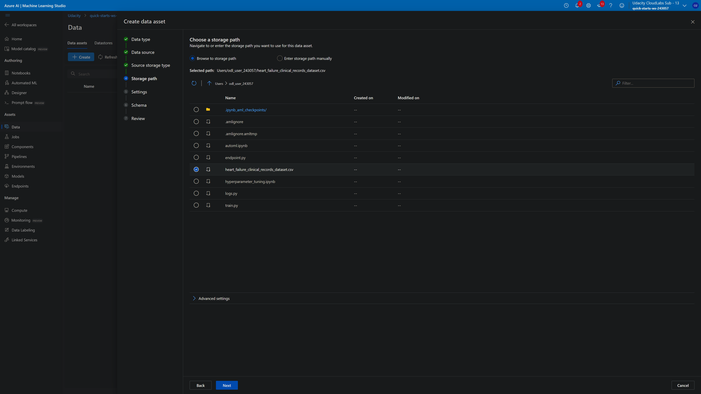
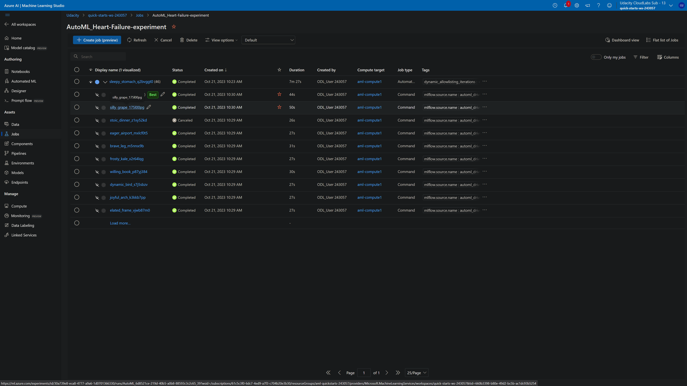
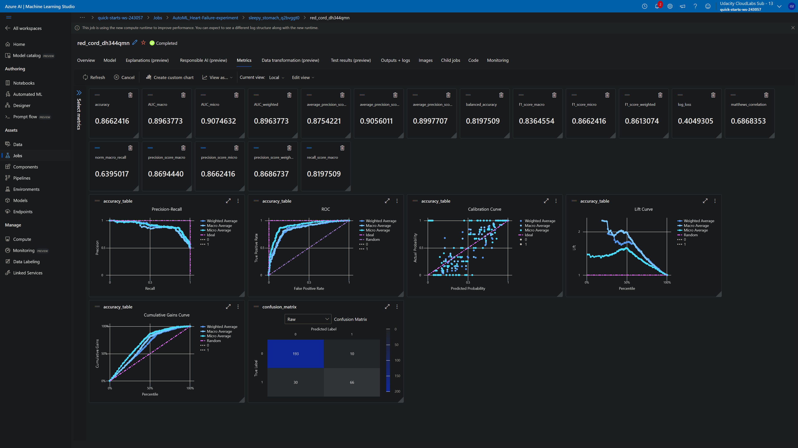
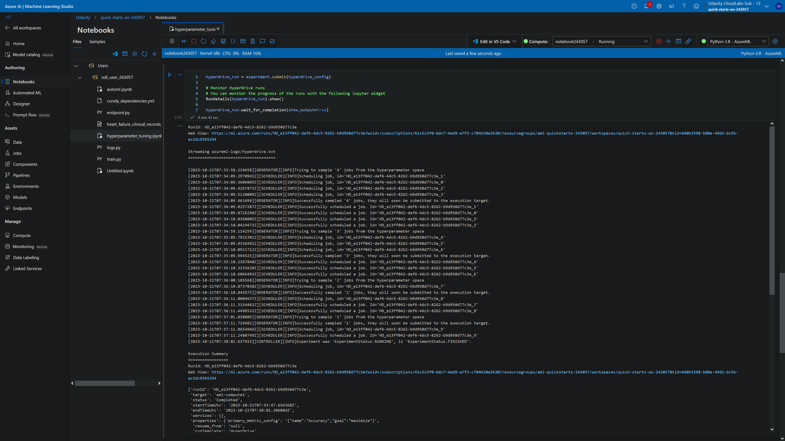
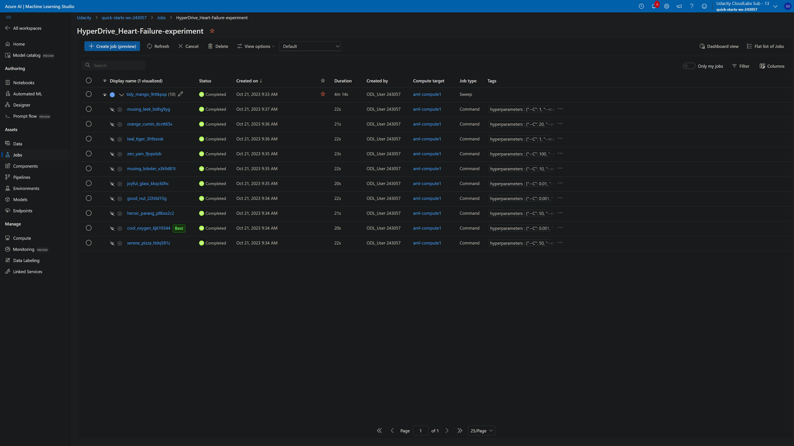
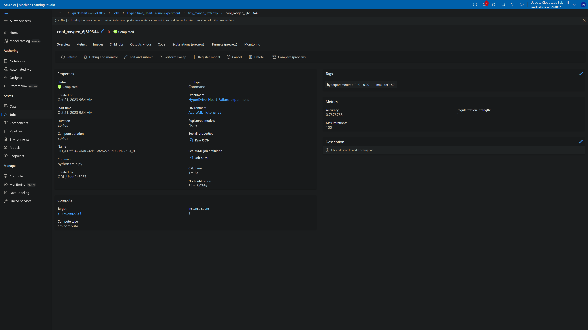
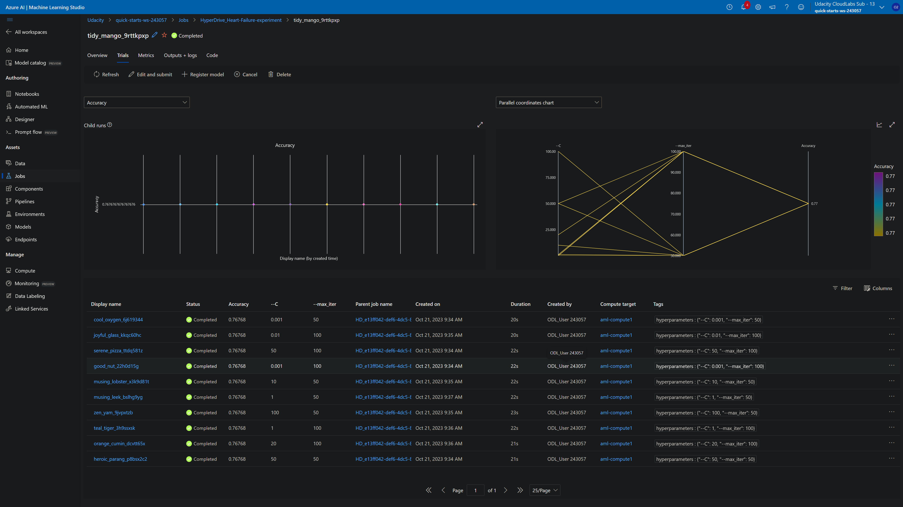
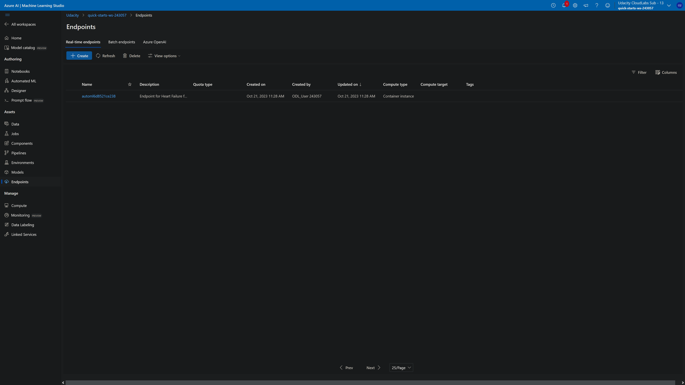
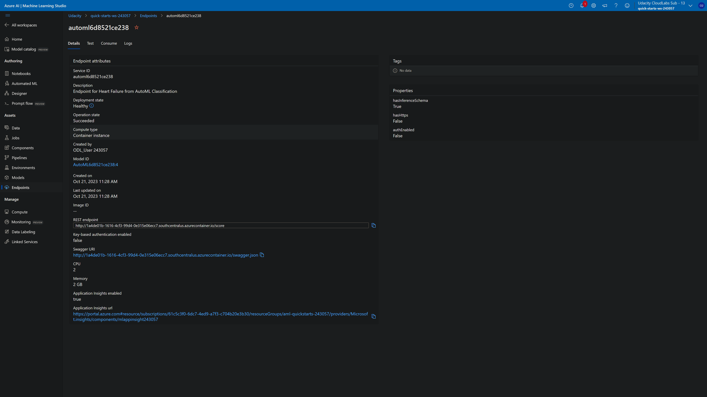
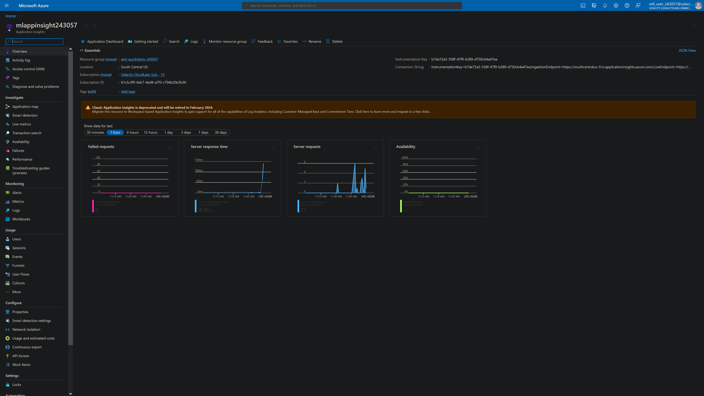

# Heart Failure Prediction with AzureML

In this AzureML project, I had the opportunity to leverage the capabilities of Azure Machine Learning to tackle an intriguing problem. The main objective of this project was to create and compare two machine learning models: one using Automated Machine Learning (AutoML) and the other a custom model with hyperparameters tuned using HyperDrive. The task at hand was to predict heart failure based on a set of clinical features using an external dataset.

### Dataset

For this project, I chose the Heart Failure Prediction dataset, which contains medical records of 299 patients who had experienced heart failure. Each patient profile consists of 13 clinical features, including age, ejection fraction, serum creatinine, and more. This dataset, characterized by its multivariate nature, was ideal for a classification task.

### Task
The project comprised several key tasks:


* **Data Preparation**: I started by importing and preparing the Heart Failure Prediction dataset for model training. Data preprocessing was essential to ensure the quality and suitability of the dataset for machine learning.



* **AutoML Model**: I used the AutoML capabilities of AzureML to create an automated machine learning model. AutoML helped identify the best algorithm and configuration for the given task.






* **HyperDrive Model**: For the custom model, I utilized HyperDrive to tune the hyperparameters of a selected machine learning algorithm. This allowed for optimizing the model's performance.






* **Model Comparison**: After creating both models, I compared their performance using appropriate evaluation metrics, such as accuracy, precision, and recall.



* **Model Deployment**: The best-performing model was deployed as a web service, making it accessible for real-time predictions.



* **Testing the Web Service**: To ensure the deployed web service was functioning as expected, I tested it with sample data.


### Access
* **Dataset Upload in Azure ML Studio**: I uploaded the dataset to Azure ML Studio from a local file. The dataset, named "heart_failure_clinical_records_dataset.csv," was also made available on GitHub for reference.

* **Code for Dataset Availability**: In both the "automl.ipynb" and "hyperparameter_tuning.ipynb" notebooks, I implemented code to check if the dataset in CSV format had been uploaded. If not, the code was designed to retrieve the dataset directly from the GitHub repository, ensuring that the data was accessible for the machine learning experiments. This approach allowed for flexibility in data sourcing, making it easy to work with the dataset in Azure ML Studio.

## Automated ML
#### AutoML Settings:

* **n_cross_validations: 2**

    * This setting specifies the number of cross-validations to perform during the training process. Cross-validation helps assess the model's generalization performance.

* **primary_metric: 'accuracy'**

    * The primary metric is set to 'accuracy,' which is a common evaluation metric for classification tasks. It measures the ratio of correctly predicted instances to the total instances.

* **enable_early_stopping: True**

    * Enabling early stopping allows the AutoML process to terminate if the performance improvement is not significant, which can save time and resources.

* **max_concurrent_iterations: 4**

    * This setting controls the maximum number of iterations to run concurrently. It can help manage resource usage effectively.

* **experiment_timeout_minutes: 20**

    * The experiment timeout, set to 20 minutes, defines the maximum time for the AutoML experiment to run. If the experiment does not complete within this time, it will terminate.

* **verbosity: logging.INFO**

    * The verbosity level is set to 'INFO,' which provides detailed logging information during the AutoML run. This can be useful for monitoring and debugging.

#### AutoML Configuration:

* **compute_target:The 'compute_target' specifies the Azure Machine Learning compute target on which the AutoML experiment is executed. It ensures the experiment runs on the selected compute resource.

* **task: 'classification'**

    * The task is defined as 'classification,' indicating that this is a binary classification problem where the goal is to predict whether a patient will experience a death event ('DEATH_EVENT').

* **training_data: 'dataset'**

    * The 'dataset' variable refers to the training dataset that contains the clinical features and the target variable.

* **label_column_name: 'DEATH_EVENT'**

    * 'DEATH_EVENT' is set as the label column name, indicating the target variable to be predicted by the model.

* **featurization: 'auto'**

    * Featurization is set to 'auto,' which means that feature engineering and transformation will be performed automatically by AutoML.

* **debug_log: "automl_errors.log"**

    * The 'debug_log' parameter specifies the log file where any errors or debugging information during the AutoML run will be stored for reference.

* **enable_onnx_compatible_models: False**

    *  The setting to enable ONNX-compatible models is turned off, meaning that the output model will not be in the ONNX format.

These settings and configurations ensure that the AutoML experiment is conducted with the specified parameters and on the designated compute target, following best practices for a classification task.

### Results

**Model Information:**
- **Pipeline Used:** Ensemble (VotingEnsemble)
- **Best Individual Pipeline Score:** 0.8562
- **Ensemble Algorithms:** ['XGBoostClassifier', 'LightGBM', 'LightGBM', 'LightGBM', 'RandomForest', 'XGBoostClassifier', 'LogisticRegression', 'XGBoostClassifier', 'XGBoostClassifier', 'RandomForest', 'KNN']
- **Ensembled Iterations:** [21, 28, 32, 5, 26, 19, 17, 34, 33, 22, 13]
- **Ensemble Weights:** [0.1538, 0.0769, 0.0769, 0.0769, 0.0769, 0.0769, 0.0769, 0.0769, 0.1538, 0.0769, 0.0769]

**Observations:**
- The AutoML model achieved an accuracy of 0.8662, indicating that it correctly predicted approximately 86.62% of the cases.
- The F1 score (micro) and weighted accuracy were also relatively high, suggesting good overall model performance.
- The model used an ensemble technique (VotingEnsemble) that combined the predictions of multiple base models, which often leads to improved accuracy and robustness.
- The best individual pipeline scored 0.8562, and it was used as part of the ensemble.

**Possible Improvements:**
To further enhance the model's performance, the following steps can be considered:

*  **Increase Cross-Validations**: Increase the number of cross-validations (n_cross_validations) to obtain more robust and reliable model evaluations. Using a higher value, such as 5 or 10, can provide a better estimate of the model's generalization performance.

*  **Optimize Primary Metric**: While accuracy is a common metric for classification tasks, it may not always be the most appropriate. Consider whether other metrics like F1 score, precision, or recall are more relevant for your specific problem and adjust the primary_metric accordingly.

* **Feature Engineering:** Exploring additional feature engineering techniques or domain-specific knowledge to create more relevant features might improve model performance.

* **Hyperparameter Tuning:** Fine-tuning the hyperparameters of the selected algorithms, including those used in the ensemble, can lead to better results.

* **Additional Data:** If available, incorporating more data or other relevant datasets might increase the model's predictive power.

## Hyperparameter Tuning
For the HyperDrive experiment in your project, a logistic regression model was chosen. Logistic regression is a widely used classification algorithm known for its simplicity and interpretability. It's often a good choice as a baseline model for binary classification problems, including predicting outcomes like the "DEATH_EVENT" in the Heart Failure Prediction dataset.

**Model Choice Rationale:**
- **Logistic Regression:** Logistic regression was chosen due to its simplicity, efficiency, and interpretability. It's particularly suitable for binary classification tasks, making it a good initial choice for this project.

**Hyperparameter Search Configuration:**
- **Hyperparameter Search Space:** The hyperparameter search space was defined using RandomParameterSampling, allowing for exploration of different values for two hyperparameters: 'C' and 'max_iter.'

- **'C' (Inverse of Regularization Strength):** The choice of 'C' is sampled from a set of values: [0.001, 0.01, 0.1, 1, 10, 20, 50, 100]. 'C' controls the trade-off between fitting the training data and preventing overfitting. Smaller values of 'C' apply stronger regularization, while larger values make the model fit the data more closely.

- **'max_iter' (Maximum Number of Iterations):** The choice of 'max_iter' is sampled from the set of values: [50, 100]. It defines the maximum number of iterations for the logistic regression solver to converge. This hyperparameter ensures that the optimization process does not run indefinitely.

**Early Termination Policy:**
- An early termination policy, BanditPolicy, was implemented with an evaluation_interval of 2 and a slack_factor of 0.1. This policy allows early termination of poorly performing runs, helping to conserve resources.

**ScriptRunConfig:**
- The training script, "train.py," was configured as the entry script for the HyperDrive run.

**HyperDriveConfig:**
- HyperDriveConfig was created with the specified run configuration, hyperparameter sampling, early termination policy, and other settings.
- The primary_metric_name was set to 'Accuracy,' and the primary_metric_goal to 'MAXIMIZE.'
- The maximum total runs were set to 10, and the maximum concurrent runs were set to 4.

This configuration allows for the systematic exploration of hyperparameter combinations in logistic regression, with the goal of maximizing accuracy in the binary classification task. The early termination policy ensures that the HyperDrive experiment doesn't waste resources on poorly performing runs.


### Results

**Model Information:**
- **Pipeline Used:** Logistic Regression
- **Best Individual Pipeline Score:** 0.7677

**Observations:**
- The AutoML experiment utilized a Logistic Regression pipeline, and the best individual pipeline achieved an accuracy of approximately 76.77%, indicating that it correctly predicted about 76.77% of the cases.
- The selected model used default hyperparameters, and no feature engineering or preprocessing beyond the built-in capabilities of AutoML was performed.
- The AutoML process used early stopping to save time and resources.
- The experiment configuration included 2-fold cross-validation, which is a relatively small number for estimating model performance.

**Possible Improvements:**
To further enhance the model's performance, consider the following improvements:

* **Hyperparameter Tuning:** The experiment can benefit from a more comprehensive hyperparameter search, exploring various regularization strengths (C) and maximum iteration values to identify optimal parameter settings.

* **Feature Engineering:** Implement more advanced feature engineering techniques to enhance the representation of data for the model. This could involve handling missing values, feature scaling, or other domain-specific preprocessing.

* **Algorithm Selection:** Consider trying different classification algorithms beyond logistic regression. Experiment with algorithms such as decision trees, random forests, gradient boosting, or support vector machines to identify models that might better capture the dataset's patterns.

* **Cross-Validation:** Increase the number of cross-validation folds (n_cross_validations) to obtain more robust performance estimates.

* **Early Stopping:** Fine-tune the early stopping criteria to balance exploration and exploitation, ensuring that potentially promising model runs are not terminated prematurely.

## Model Deployment
After identifying the best model from the AutoML experiment, you can deploy it as a web service for making predictions. Here is an overview of the deployed model and instructions on how to query the endpoint with a sample input:

**Deployed Model Overview:**
- **Model Type:** Classification
- **Best Model:** The best model from the AutoML experiment was selected for deployment.
- **Model Name:** Best Model
- **Description:** A machine learning model trained to predict heart failure based on the provided dataset.
- **Endpoint Configuration:** The model was deployed as an Azure Container Instance (ACI) web service with specific resource configurations.

**Instructions to Query the Endpoint:**

1. **Get the Authentication Token:** You need an authentication token to make requests to the deployed web service. You can obtain the token using the Azure SDK, like so:

   ```python
   from azureml.core.authentication import InteractiveLoginAuthentication

   # Perform interactive login
   interactive_auth = InteractiveLoginAuthentication()
   auth_token, _ = interactive_auth.get_authentication_token()
   ```

2. **Prepare a Sample Input:** To query the endpoint, you'll need to create a sample input data point in the same format as the training data used for the model. Ensure the input data contains the necessary features required for prediction.

3. **Make a POST Request to the Endpoint:** Use the `requests` library in Python to make a POST request to the web service endpoint, passing the input data as JSON. Here's an example of how to do this:

   ```python
   import requests
   import json

   # Endpoint URL
   endpoint_url = aci_service.scoring_uri

   # Sample input data (replace with your actual input data)
   sample_input = {
       "feature1": 0.2,
       "feature2": 0.4,
       "feature3": 0.6,
       # Add more features as required
   }

   # Convert input to JSON
   input_data = json.dumps({"data": [sample_input]})

   # Set the content type for the request
   headers = {
       "Content-Type": "application/json",
       "Authorization": f"Bearer {auth_token}",
   }

   # Make the POST request
   response = requests.post(endpoint_url, input_data, headers=headers)

   # Get the prediction results
   prediction = json.loads(response.text)

   # Display the prediction
   print("Prediction:", prediction)
   ```

4. **Interpreting the Response:** The response from the endpoint will contain the model's prediction for the provided input data. You can extract and use this prediction as needed for your application.

By following these steps, you can query the deployed model and obtain predictions for heart failure based on your input data. Ensure that you replace the sample input data with your actual data for accurate predictions.